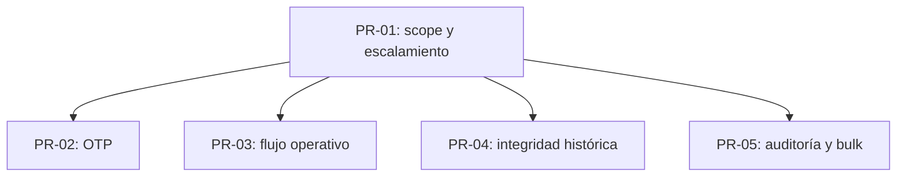

# RULES_EXECUTION_PLAN

Plan de ejecución por PRs/lotes de trabajo a partir de:
- `C:\Users\picos\Desktop\SADI\RULES_ALIGNMENT_BACKLOG.md`
- `C:\Users\picos\Desktop\SADI\BUSINESS_RULES_V3.md`

Este plan **no reinterpreta política**. Solo convierte el backlog en workstreams ejecutables.

## Estrategia general

1. **Cerrar primero el perímetro de seguridad y permisos.**
   - Si el scope y la autorización no están firmes, cualquier cambio posterior puede heredar una base insegura.
2. **Luego resolver la integridad histórica y el control de mutaciones irreversibles.**
   - Evita pérdida de trazabilidad antes de tocar flujos más amplios.
3. **Después estabilizar el flujo operativo de accesos/turnos.**
   - Aquí viven las invariantes más sensibles del dominio diario.
4. **Cerrar con auditoría persistente y bulk actions.**
   - Estas piezas validan accountability transversal y reducen superficie de incidente.

## Regla de ejecución

- Los PRs aquí definidos son **lotes de trabajo**, no un desglose conceptual.
- Las reglas ya alineadas en el backlog **no se convierten en PRs abiertos**.
- Cada PR debe incluir:
  - código,
  - pruebas,
  - y criterio de cierre verificable.
- No abrir PRs que mezclen demasiadas superficies si comparten el mismo archivo crítico sin necesidad.

## PRs propuestos

### PR-01 — Cerrar el perímetro de autorización por sede y escalamiento administrativo
- **Objetivo:** dejar completamente firme el scope por sede y bloquear cualquier escalamiento de privilegios desde `admin_sede`.
- **Reglas cubiertas:** `R-009`, `R-010`
- **Riesgo:** P0. Un fallo aquí habilita fuga cross-sede o escalamiento indebido.
- **Archivos probables:**
  - `C:\Users\picos\Desktop\SADI\services\api\accesos\domain\services\authorization.py`
  - `C:\Users\picos\Desktop\SADI\services\api\accesos\signals.py`
  - `C:\Users\picos\Desktop\SADI\services\api\accesos\models.py`
  - `C:\Users\picos\Desktop\SADI\services\api\accesos\import_services.py`
  - `C:\Users\picos\Desktop\SADI\services\api\accesos\tests_security_hardening.py`
  - `C:\Users\picos\Desktop\SADI\services\api\accesos\tests.py`
- **Tests / gates:**
  - `python manage.py check`
  - `pytest accesos\tests_security_hardening.py -q -rs`
  - `pytest accesos\tests.py -q -rs`
- **Done:**
  - ningún path runtime usa parámetros del cliente para ampliar scope;
  - `admin_sede` no puede crear/promover/reasignar cuentas administrativas;
  - las pruebas adversariales de cross-sede y privilege escalation pasan.

### PR-02 — Endurecer OTP contra abuso, reuso y enumeración
- **Objetivo:** hacer que todos los flujos OTP sean temporales, limitados, de un solo uso y no enumerables.
- **Reglas cubiertas:** `R-021`
- **Riesgo:** P0. Un bypass aquí facilita takeover y enumeración.
- **Archivos probables:**
  - `C:\Users\picos\Desktop\SADI\services\api\accesos\otp_services.py`
  - `C:\Users\picos\Desktop\SADI\services\api\accesos\views.py`
  - `C:\Users\picos\Desktop\SADI\services\api\accesos\tests.py`
  - `C:\Users\picos\Desktop\SADI\services\api\accesos\tests_security_hardening.py`
- **Tests / gates:**
  - `python manage.py check`
  - `pytest accesos\tests.py -q -rs`
  - `pytest accesos\tests_security_hardening.py -q -rs`
- **Done:**
  - OTP expira;
  - OTP se invalida tras primer uso;
  - hay límites de intentos y de solicitudes;
  - la respuesta no revela si la cuenta existe o no.

### PR-03 — Estabilizar el flujo operativo de accesos y sus invariantes de turno/equipo
- **Objetivo:** cerrar el comportamiento operativo del registro de accesos para que turno, secuencia y equipos sean coherentes.
- **Reglas cubiertas:** `R-013`, `R-017`, `R-018`
- **Riesgo:** P1. Afecta operación diaria, trazabilidad y consistencia patrimonial.
- **Archivos probables:**
  - `C:\Users\picos\Desktop\SADI\services\api\accesos\views.py`
  - `C:\Users\picos\Desktop\SADI\services\api\accesos\serializers.py`
  - `C:\Users\picos\Desktop\SADI\services\api\accesos\domain\services\access_flow_service.py`
  - `C:\Users\picos\Desktop\SADI\services\api\accesos\tests.py`
  - `C:\Users\picos\Desktop\SADI\services\api\accesos\tests_security_hardening.py`
- **Tests / gates:**
  - `python manage.py check`
  - `pytest accesos\tests.py -q -rs`
  - `pytest accesos\tests_security_hardening.py -q -rs`
- **Done:**
  - los turnos expirados se auto-cierran y quedan marcados como automáticos;
  - no hay doble entrada / doble salida / salida sin entrada;
  - la salida cierra exactamente el mismo conjunto de equipos del ingreso abierto más reciente.

### PR-04 — Blindar integridad histórica: no hard delete de equipos revisados y accesos inmutables
- **Objetivo:** impedir borrado físico de equipos ya decididos y evitar edición destructiva de accesos históricos.
- **Reglas cubiertas:** `R-004`, `R-023`
- **Riesgo:** P0/P1. Una pérdida histórica rompe auditoría y evidencia.
- **Archivos probables:**
  - `C:\Users\picos\Desktop\SADI\services\api\accesos\models.py`
  - `C:\Users\picos\Desktop\SADI\services\api\accesos\views.py`
  - `C:\Users\picos\Desktop\SADI\services\api\accesos\tests.py`
  - `C:\Users\picos\Desktop\SADI\services\api\accesos\tests_security_hardening.py`
- **Tests / gates:**
  - `python manage.py check`
  - `pytest accesos\tests.py -q -rs`
  - `pytest accesos\tests_security_hardening.py -q -rs`
- **Done:**
  - ningún equipo `APROBADO` o `RECHAZADO` puede desaparecer físicamente;
  - los accesos históricos no admiten `PATCH/PUT`;
  - el soft-delete autorizado queda como única vía destructiva.

### PR-05 — Formalizar auditoría persistente y bulk actions con validación por elemento
- **Objetivo:** garantizar accountability transversal para mutaciones críticas y evitar operaciones masivas fuera de scope.
- **Reglas cubiertas:** `R-024`, `R-025`
- **Riesgo:** P1. Un fallo aquí amplifica incidentes y reduce trazabilidad.
- **Archivos probables:**
  - `C:\Users\picos\Desktop\SADI\services\api\accesos\models.py`
  - `C:\Users\picos\Desktop\SADI\services\api\accesos\signals.py`
  - `C:\Users\picos\Desktop\SADI\services\api\accesos\views.py`
  - `C:\Users\picos\Desktop\SADI\services\api\accesos\tests_control_panel.py`
  - `C:\Users\picos\Desktop\SADI\services\api\accesos\tests_security_hardening.py`
- **Tests / gates:**
  - `python manage.py check`
  - `pytest accesos\tests_control_panel.py -q -rs`
  - `pytest accesos\tests_security_hardening.py -q -rs`
- **Done:**
  - toda acción crítica deja evento persistente con actor, rol efectivo, sede efectiva, acción, recurso, resultado, timestamp, IP y user-agent;
  - toda bulk action valida cada elemento contra el scope efectivo;
  - no se procesa ningún lote con recursos fuera de la sede/alcance del actor.

## Dependencias entre PRs

## Qué puede correr en paralelo

- **Sí pueden correr en paralelo, con ownership estricto de archivos:**
  - `PR-02` y `PR-04` si cada uno mantiene su foco y no comparte el mismo tramo de `views.py`.
  - `PR-02` y `PR-05` solo si el trabajo de OTP queda aislado del trabajo de auditoría/bulk.
- **No deben correr en paralelo:**
  - `PR-03` con `PR-05`, porque ambos necesitan cambios coordinados en `services/api/accesos/views.py`.
  - `PR-01` con cualquier PR que vuelva a tocar la misma lógica de scope/permisos.
  - `PR-03` con `PR-04` si terminan compartiendo la misma zona de `views.py` o validaciones de acceso.

## Orden recomendado de merge

1. **PR-01**
2. **PR-02**
3. **PR-04**
4. **PR-03**
5. **PR-05**

## Reglas ya resueltas que no se abren como PR

Estas reglas quedan fuera del plan de ejecución porque ya están alineadas y solo requieren regresión:

- `R-001`
- `R-002`
- `R-003`
- `R-005`
- `R-006`
- `R-007`
- `R-008`
- `R-011`
- `R-012`
- `R-014`
- `R-015`
- `R-016`
- `R-019`
- `R-020`
- `R-022`

## Criterio global de aceptación del plan

El plan queda listo para ejecución cuando:
- cada PR tiene un dueño claro,
- cada PR tiene tests/gates definidos,
- no hay solapamiento innecesario de archivos,
- y el orden de merge respeta las dependencias de seguridad primero y trazabilidad después.

